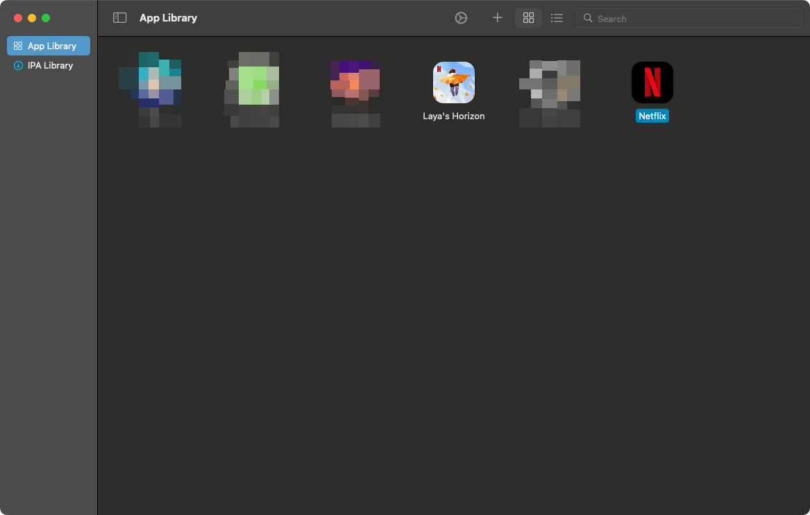
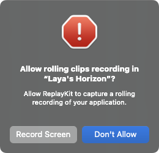
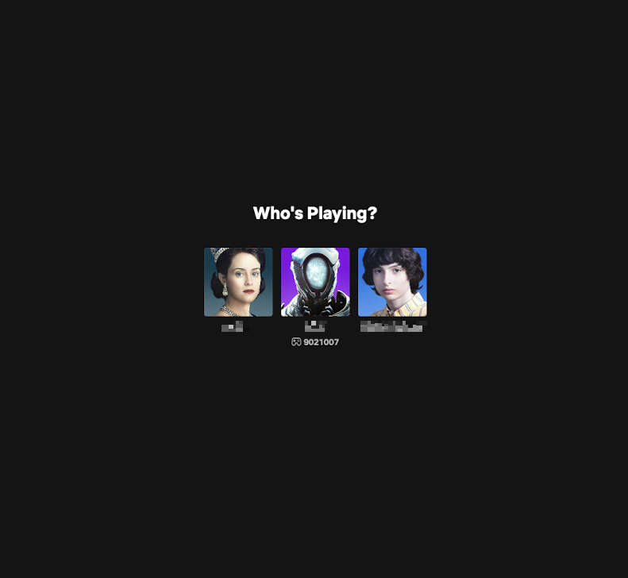
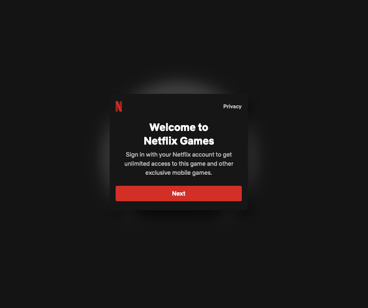

# Launching Laya's Horizon

Drag your Laya's Horizon ipa file into the PlayCover window. It will install the app. If asked to install PlayTools, say yes.

Laya's Horizon will now appear in the PlayCover window.

## Settings

This will be a lot less finnicky than Netflix.

- Keymapping
  - Disabled
- Graphics
  - Device: Whatever was preselected for you
  - Resolution: Auto (Based on Display)
  - Disable display sleep: Disabled (unchecked)
- Jailbreak Bypass
  - Enabled
- Misc
  - Enable Discord Activity: Disabled

Then, click "OK" and launch Laya's Horizon by double clicking on it.

:::danger
## If you are prompted to enable rolling clips recording, **say Don't Allow**.

There is a memory leak associated with this feature that will cause your device to run out of memory and swap. This will cause your device to slow down to a crawl and eventually crash.

If you accidentally enable it, quit the Laya's Horizon immediately and relaunch it.
:::

## Signing in
If all goes well, you will be instantly prompted with the profile selection screen. Select your profile, and you're done!

If you are instead prompted with "Welcome to Netflix Games", quit and relaunch. Keep doing this until you are prompted with the profile selection screen.
