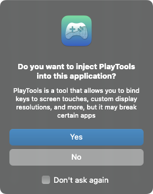
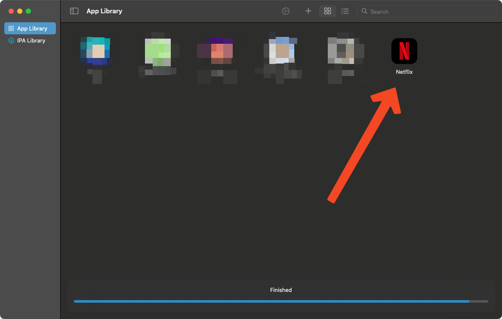
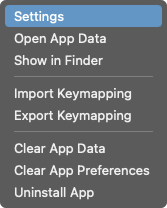
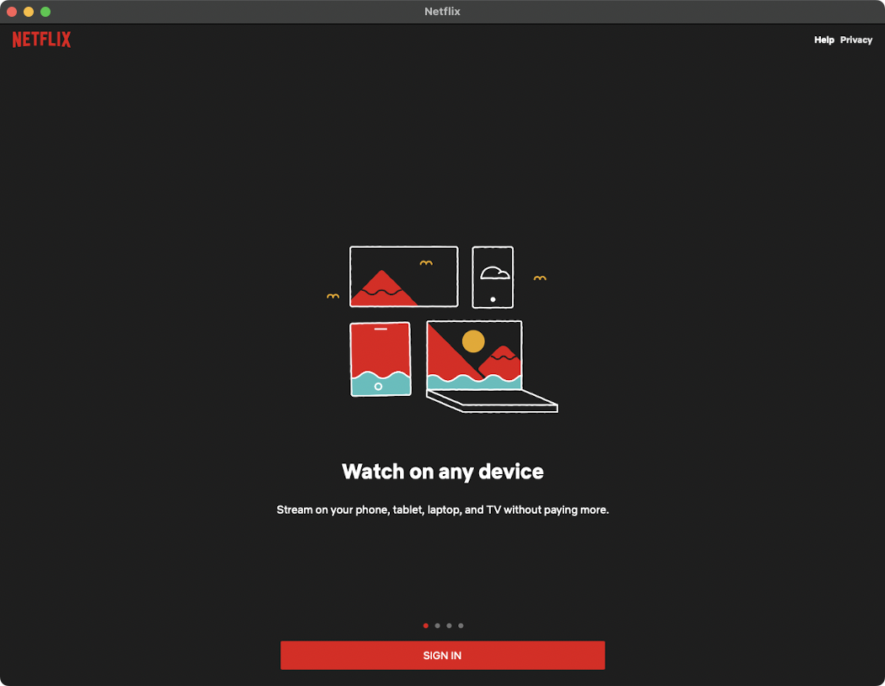
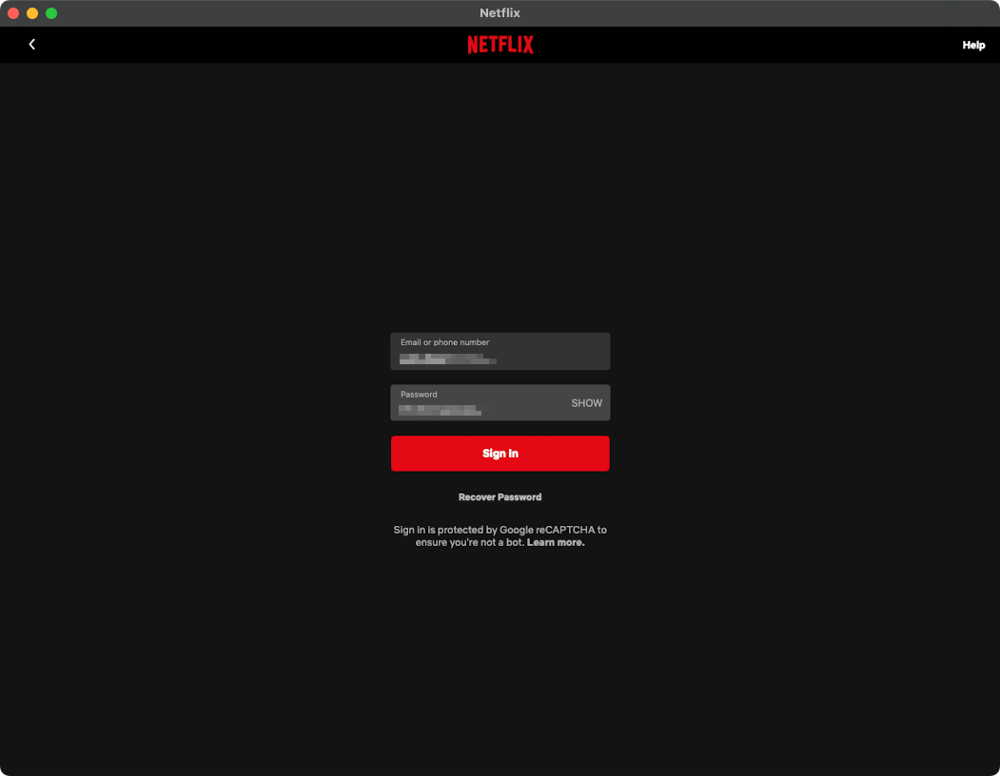
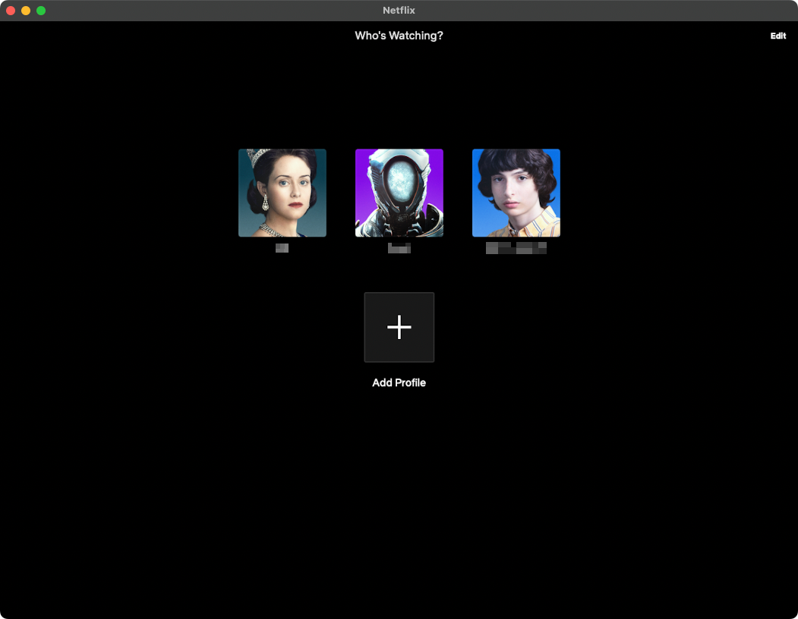

# Authenticating Netflix

Laya's Horizon will not start without detecting a valid Netflix subscription, and to get that, we need to launch Netflix and sign in.

## Launching Netflix

Open PlayCover.

Drag and drop your netflix ipa file into the PlayCover window. It will install the app. If asked to install PlayTools, say yes.

Netflix will now appear in the PlayCover window.

Right click on Netflix, and select "Settings".

## Settings

Set your settings to the following, or as close as possible to the following. 

**You may need to play around with these to get it to work. It may take launching over and over to work.**

You can also right click on Netflix on the PlayCover home screen and "Clear App Data" to troubleshoot.

- Keymapping
  - Disabled
- Graphics
  - Device: iPhone 13 Pro Max
  - Resolution: App Default
  - Disable display sleep: Disabled (unchecked)
- Jailbreak Bypass
  - Enabled
- Misc
  - Enable Discord Activity: Disabled

Then, click "OK" and launch Netflix by double clicking on it.

## Signing in

Hopefully you have gotten Netflix to launch.

Enter your Netflix credentials and sign in.

If all goes well, you'll be greeted by the profile selection screen. Select your profile, and you're done!

