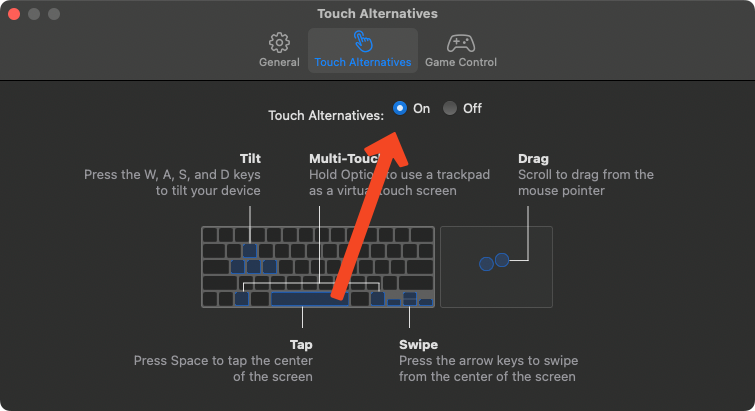
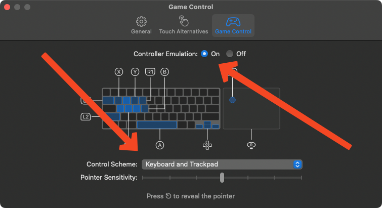

# Actually Playing

You might be asking yourelf, "How exactly do you play a game on MacOS that was designed around having two fingers to control the game?"

Well, you're in luck. This guide will show you how to play Laya's Horizon on MacOS.

## What you'll need

- Your hands
- A trackpad, or (even better) a Bluetooth game controller

## Playing with a trackpad

Unfortunately, it's not as simple as iOS.

### Using iOS Controls

You can use the iOS controls, but there's a catch. You will need to hold down the Option key **the whole time.**

To do this, open the Laya's Horizon settings by going to the menu bar, clicking on Laya's Horizon, and clicking on "Preferences". You can also use `Cmd + ,`.

Then, click on the "Touch Alternatives" tab, and enable it.

You can now return to the game. Whenever you want to use the touch controls, hold down the Option key. You can now use the touch controls, with your trackpad as a virtual screen. Maybe set something down on top of the option key to hold it down, or use a third-party program to make a virtual keyboaard that holds down the option key for you.

### Using a virtual controller

You can also use a virtual controller. This is a bit more complicated, but I find it better than using the iOS controls... ish.

To do this, open the Laya's Horizon settings by going to the menu bar, clicking on Laya's Horizon, and clicking on "Preferences". You can also use `Cmd + ,`.

Then, click on the "Game Control" tab, and enable it. Make sure "Control Scheme" is set to "Keybaord and Trackpad".

You can now return to the game. Your trackpad now controls the right side of the cape, and the left side of the wing is controlled by the WASD keys. To select buttons, use the space bar. To pause the game, press `esc`. To navigate the menu, use the WASD keys.

## Playing with a Bluetooth controller

This is the best way to play Laya's Horizon on MacOS. It's just like playing on iOS, but with a controller.

You can also pair this controller with your iOS device and play Laya's Horizon on there, too!

Read the directions on your controller to pair it with your Mac. Then, open Laya's Horizon, and you're done! Make sure to launch the game with the controller connected, or it won't work.

# Have fun!

You can now play Laya's Horizon on MacOS. Enjoy!

You can reach out to me with any questions on Discord, at [@9021007](https://discord.com/users/363450765307805696). I would recommend that you chat with me on the [Snowman Discord server](https://discord.gg/snowman), so that any questions you have can be read by others who may have the same questions.